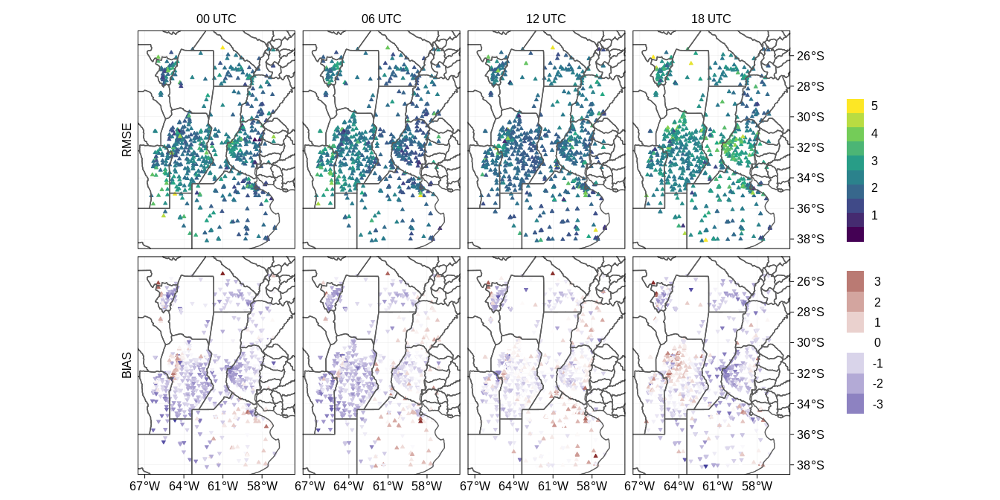

rmse/bias espacial (obs de superficie)
================

## Interpolación de los pronósticos a las observaciones

El RRR generó pronósticos a 36 horas inicializados a partir de los
análisis cada 3 horas.

Los archivos que guardan la información de cada observación y de los
pronósticos interpolados tienen la siguiente pinta:

<table class="table" style="font-size: 10px; margin-left: auto; margin-right: auto;">

<thead>

<tr>

<th style="text-align:right;">

lon

</th>

<th style="text-align:right;">

lat

</th>

<th style="text-align:left;">

time.obs

</th>

<th style="text-align:right;">

time.slot

</th>

<th style="text-align:right;">

ens

</th>

<th style="text-align:right;">

fcst

</th>

<th style="text-align:right;">

obs.id

</th>

<th style="text-align:right;">

elev

</th>

<th style="text-align:right;">

obs

</th>

<th style="text-align:right;">

error

</th>

<th style="text-align:right;">

sub.id

</th>

<th style="text-align:right;">

ens.obs

</th>

<th style="text-align:right;">

ana.obs

</th>

<th style="text-align:left;">

time

</th>

</tr>

</thead>

<tbody>

<tr>

<td style="text-align:right;">

293.6466

</td>

<td style="text-align:right;">

\-33.27592

</td>

<td style="text-align:left;">

2018-11-09

</td>

<td style="text-align:right;">

7

</td>

<td style="text-align:right;">

1

</td>

<td style="text-align:right;">

925.9386

</td>

<td style="text-align:right;">

14593

</td>

<td style="text-align:right;">

768

</td>

<td style="text-align:right;">

922.6

</td>

<td style="text-align:right;">

1

</td>

<td style="text-align:right;">

22

</td>

<td style="text-align:right;">

1.520229

</td>

<td style="text-align:right;">

1.495311

</td>

<td style="text-align:left;">

2018-11-09

</td>

</tr>

<tr>

<td style="text-align:right;">

293.6466

</td>

<td style="text-align:right;">

\-33.27592

</td>

<td style="text-align:left;">

2018-11-09

</td>

<td style="text-align:right;">

7

</td>

<td style="text-align:right;">

2

</td>

<td style="text-align:right;">

926.6204

</td>

<td style="text-align:right;">

14593

</td>

<td style="text-align:right;">

768

</td>

<td style="text-align:right;">

922.6

</td>

<td style="text-align:right;">

1

</td>

<td style="text-align:right;">

22

</td>

<td style="text-align:right;">

1.520229

</td>

<td style="text-align:right;">

1.495311

</td>

<td style="text-align:left;">

2018-11-09

</td>

</tr>

<tr>

<td style="text-align:right;">

293.6466

</td>

<td style="text-align:right;">

\-33.27592

</td>

<td style="text-align:left;">

2018-11-09

</td>

<td style="text-align:right;">

7

</td>

<td style="text-align:right;">

3

</td>

<td style="text-align:right;">

926.8457

</td>

<td style="text-align:right;">

14593

</td>

<td style="text-align:right;">

768

</td>

<td style="text-align:right;">

922.6

</td>

<td style="text-align:right;">

1

</td>

<td style="text-align:right;">

22

</td>

<td style="text-align:right;">

1.520229

</td>

<td style="text-align:right;">

1.495311

</td>

<td style="text-align:left;">

2018-11-09

</td>

</tr>

<tr>

<td style="text-align:right;">

293.6466

</td>

<td style="text-align:right;">

\-33.27592

</td>

<td style="text-align:left;">

2018-11-09

</td>

<td style="text-align:right;">

7

</td>

<td style="text-align:right;">

4

</td>

<td style="text-align:right;">

926.0495

</td>

<td style="text-align:right;">

14593

</td>

<td style="text-align:right;">

768

</td>

<td style="text-align:right;">

922.6

</td>

<td style="text-align:right;">

1

</td>

<td style="text-align:right;">

22

</td>

<td style="text-align:right;">

1.520229

</td>

<td style="text-align:right;">

1.495311

</td>

<td style="text-align:left;">

2018-11-09

</td>

</tr>

<tr>

<td style="text-align:right;">

293.6466

</td>

<td style="text-align:right;">

\-33.27592

</td>

<td style="text-align:left;">

2018-11-09

</td>

<td style="text-align:right;">

7

</td>

<td style="text-align:right;">

5

</td>

<td style="text-align:right;">

927.2709

</td>

<td style="text-align:right;">

14593

</td>

<td style="text-align:right;">

768

</td>

<td style="text-align:right;">

922.6

</td>

<td style="text-align:right;">

1

</td>

<td style="text-align:right;">

22

</td>

<td style="text-align:right;">

1.520229

</td>

<td style="text-align:right;">

1.495311

</td>

<td style="text-align:left;">

2018-11-09

</td>

</tr>

<tr>

<td style="text-align:right;">

293.6466

</td>

<td style="text-align:right;">

\-33.27592

</td>

<td style="text-align:left;">

2018-11-09

</td>

<td style="text-align:right;">

7

</td>

<td style="text-align:right;">

6

</td>

<td style="text-align:right;">

926.0994

</td>

<td style="text-align:right;">

14593

</td>

<td style="text-align:right;">

768

</td>

<td style="text-align:right;">

922.6

</td>

<td style="text-align:right;">

1

</td>

<td style="text-align:right;">

22

</td>

<td style="text-align:right;">

1.520229

</td>

<td style="text-align:right;">

1.495311

</td>

<td style="text-align:left;">

2018-11-09

</td>

</tr>

<tr>

<td style="text-align:right;">

293.6466

</td>

<td style="text-align:right;">

\-33.27592

</td>

<td style="text-align:left;">

2018-11-09

</td>

<td style="text-align:right;">

7

</td>

<td style="text-align:right;">

7

</td>

<td style="text-align:right;">

926.0193

</td>

<td style="text-align:right;">

14593

</td>

<td style="text-align:right;">

768

</td>

<td style="text-align:right;">

922.6

</td>

<td style="text-align:right;">

1

</td>

<td style="text-align:right;">

22

</td>

<td style="text-align:right;">

1.520229

</td>

<td style="text-align:right;">

1.495311

</td>

<td style="text-align:left;">

2018-11-09

</td>

</tr>

<tr>

<td style="text-align:right;">

293.6466

</td>

<td style="text-align:right;">

\-33.27592

</td>

<td style="text-align:left;">

2018-11-09

</td>

<td style="text-align:right;">

7

</td>

<td style="text-align:right;">

8

</td>

<td style="text-align:right;">

925.7258

</td>

<td style="text-align:right;">

14593

</td>

<td style="text-align:right;">

768

</td>

<td style="text-align:right;">

922.6

</td>

<td style="text-align:right;">

1

</td>

<td style="text-align:right;">

22

</td>

<td style="text-align:right;">

1.520229

</td>

<td style="text-align:right;">

1.495311

</td>

<td style="text-align:left;">

2018-11-09

</td>

</tr>

<tr>

<td style="text-align:right;">

293.6466

</td>

<td style="text-align:right;">

\-33.27592

</td>

<td style="text-align:left;">

2018-11-09

</td>

<td style="text-align:right;">

7

</td>

<td style="text-align:right;">

9

</td>

<td style="text-align:right;">

926.6326

</td>

<td style="text-align:right;">

14593

</td>

<td style="text-align:right;">

768

</td>

<td style="text-align:right;">

922.6

</td>

<td style="text-align:right;">

1

</td>

<td style="text-align:right;">

22

</td>

<td style="text-align:right;">

1.520229

</td>

<td style="text-align:right;">

1.495311

</td>

<td style="text-align:left;">

2018-11-09

</td>

</tr>

<tr>

<td style="text-align:right;">

293.6466

</td>

<td style="text-align:right;">

\-33.27592

</td>

<td style="text-align:left;">

2018-11-09

</td>

<td style="text-align:right;">

7

</td>

<td style="text-align:right;">

10

</td>

<td style="text-align:right;">

925.5682

</td>

<td style="text-align:right;">

14593

</td>

<td style="text-align:right;">

768

</td>

<td style="text-align:right;">

922.6

</td>

<td style="text-align:right;">

1

</td>

<td style="text-align:right;">

22

</td>

<td style="text-align:right;">

1.520229

</td>

<td style="text-align:right;">

1.495311

</td>

<td style="text-align:left;">

2018-11-09

</td>

</tr>

</tbody>

</table>

O sea agrego un par de columnas a los .dat de siempre. Las columnas
`fcst` corresponden al pronóstico interpolado y la columna `time`
corresponde a la hora/día de validación de ese pronóstico. Esto se hace
para cada tipo de observación.

[Script que hace
esto](https://github.com/paocorrales/Validacion_RRA/blob/master/interp_obs_parallel.R)

## Cálculo del RMSE/BIAS

Este cálculo puede llevar tiempo por lo que está paralelizado en este
script. Pero la idea general es la siguiente:

``` r
path <- "donde sea que están los archivos con la info interpolada"
files <- Sys.glob(path)

out <- foreach(f = 1:length(files),
               .packages = c("data.table", "lubridate", "dplyr"),
               .export = c("files"),
               .combine = "rbind") %dopar% {
                 
                 # Leo el archivo de turno
                 fcst <- fread(files[f])
                 
                 # Extraigo la hora de inicialización del pronóstico
                 fecha_ini <- ymd_h(stringr::str_extract(files[f], "\\d{8}_\\d{2}"))
                 
                 # obs.fcst es la resta entre la observación y el pronóstico interpolado
                 # verif es la hora de verificación del pronóstico en horas, va de 0 a 36.
                 
                 temp <- fcst[, `:=`(obs.fcst = obs - fcst,
                                     fecha.ini = fecha_ini,
                                     verif = as.numeric(as.duration(as_datetime(time.obs) - fecha_ini), "hour"))] %>%
                   .[, .(rmse = sqrt(mean(obs.fcst^2, na.rm = TRUE)), 
                         bias = mean(obs.fcst, na.rm = TRUE)), by = .(verif, fecha.ini, lon, lat)]
                 # Las últimas 2 lineas calculan el rmse y el bias para cada hora de verificación (verif), cada inicialización
                 # (fecha.ini), cada latitud y longitud
               }

# Reune toda la información del loop anterior que va por todos los pronósticos y guarda un ínico archivo.
fwrite(out, "/algún lugar del universo/espacial_rmse_83331.csv")
```

Acá la clave está en calcular el rmse y el bias para cada lat, lon (lo
que te asegura, si está todo bien, que hace el cálculo para cada
estación) y para cada inicialización y hora de verificación.

La tabla final tiene la siguiente pinta:

<table class="table" style="font-size: 10px; margin-left: auto; margin-right: auto;">

<thead>

<tr>

<th style="text-align:right;">

verif

</th>

<th style="text-align:left;">

fecha.ini

</th>

<th style="text-align:right;">

lon

</th>

<th style="text-align:right;">

lat

</th>

<th style="text-align:right;">

rmse

</th>

<th style="text-align:right;">

bias

</th>

</tr>

</thead>

<tbody>

<tr>

<td style="text-align:right;">

0

</td>

<td style="text-align:left;">

2018-11-09

</td>

<td style="text-align:right;">

293.4866

</td>

<td style="text-align:right;">

\-33.63525

</td>

<td style="text-align:right;">

NA

</td>

<td style="text-align:right;">

NA

</td>

</tr>

<tr>

<td style="text-align:right;">

0

</td>

<td style="text-align:left;">

2018-11-09

</td>

<td style="text-align:right;">

293.5647

</td>

<td style="text-align:right;">

\-33.33604

</td>

<td style="text-align:right;">

NA

</td>

<td style="text-align:right;">

NA

</td>

</tr>

<tr>

<td style="text-align:right;">

0

</td>

<td style="text-align:left;">

2018-11-09

</td>

<td style="text-align:right;">

293.6466

</td>

<td style="text-align:right;">

\-33.27592

</td>

<td style="text-align:right;">

1.8942050

</td>

<td style="text-align:right;">

\-1.8732017

</td>

</tr>

<tr>

<td style="text-align:right;">

0

</td>

<td style="text-align:left;">

2018-11-09

</td>

<td style="text-align:right;">

293.6468

</td>

<td style="text-align:right;">

\-35.71217

</td>

<td style="text-align:right;">

0.7647855

</td>

<td style="text-align:right;">

0.6593999

</td>

</tr>

<tr>

<td style="text-align:right;">

0

</td>

<td style="text-align:left;">

2018-11-09

</td>

<td style="text-align:right;">

293.6500

</td>

<td style="text-align:right;">

\-33.27000

</td>

<td style="text-align:right;">

0.8068805

</td>

<td style="text-align:right;">

\-0.7602938

</td>

</tr>

<tr>

<td style="text-align:right;">

0

</td>

<td style="text-align:left;">

2018-11-09

</td>

<td style="text-align:right;">

293.6853

</td>

<td style="text-align:right;">

\-33.15642

</td>

<td style="text-align:right;">

0.8191404

</td>

<td style="text-align:right;">

0.7727374

</td>

</tr>

<tr>

<td style="text-align:right;">

0

</td>

<td style="text-align:left;">

2018-11-09

</td>

<td style="text-align:right;">

293.7200

</td>

<td style="text-align:right;">

\-30.37000

</td>

<td style="text-align:right;">

NA

</td>

<td style="text-align:right;">

NA

</td>

</tr>

<tr>

<td style="text-align:right;">

0

</td>

<td style="text-align:left;">

2018-11-09

</td>

<td style="text-align:right;">

293.7550

</td>

<td style="text-align:right;">

\-25.33200

</td>

<td style="text-align:right;">

NA

</td>

<td style="text-align:right;">

NA

</td>

</tr>

<tr>

<td style="text-align:right;">

0

</td>

<td style="text-align:left;">

2018-11-09

</td>

<td style="text-align:right;">

293.7570

</td>

<td style="text-align:right;">

\-33.26172

</td>

<td style="text-align:right;">

2.9065640

</td>

<td style="text-align:right;">

2.8946285

</td>

</tr>

<tr>

<td style="text-align:right;">

0

</td>

<td style="text-align:left;">

2018-11-09

</td>

<td style="text-align:right;">

293.7718

</td>

<td style="text-align:right;">

\-33.23122

</td>

<td style="text-align:right;">

3.1962604

</td>

<td style="text-align:right;">

3.1850300

</td>

</tr>

</tbody>

</table>

## Graficado

``` r
# Leo el resultado de lo anterior para cada variable
files <- Sys.glob("/home/paola.corrales/datosmunin3/RRA_Validacion/RRA_Fcst/estadisticos/espacial*")

est_espacial <- lapply(files, function(f) {
  
  var <- str_extract(f, "\\d{5}")
  
  tmp <- fread(f) %>% 
    .[, var := var] %>%
    .[, fecha.ini := ymd_hms(fecha.ini)] %>% # Fecha, hora de inicialización
    .[, hora.ini := hour(fecha.ini)] %>%     # Hora de inicialización
    .[]
  
  return(tmp)
} ) %>% 
  rbindlist() 

# Agrego una columna con el nombre de la variable
est_espacial[, var.type := case_when(var %in% c(2819, 82819) ~ "u",
                                     var %in% c(2820, 82820) ~ "v",
                                     var %in% c(3073, 83073) ~ "t",
                                     var %in% c(3330, 83330) ~ "q",
                                     var %in% c(3331, 83331) ~ "rh",
                                     var %in% c(4001) ~ "dBz",
                                     var %in% c(14593) ~ "p")]

est_espacial %>% 
  head(10) %>% 
  kable("html") %>% 
  kable_styling(font_size = 10)
```

<table class="table" style="font-size: 10px; margin-left: auto; margin-right: auto;">

<thead>

<tr>

<th style="text-align:right;">

verif

</th>

<th style="text-align:left;">

fecha.ini

</th>

<th style="text-align:right;">

lon

</th>

<th style="text-align:right;">

lat

</th>

<th style="text-align:right;">

rmse

</th>

<th style="text-align:right;">

bias

</th>

<th style="text-align:left;">

var

</th>

<th style="text-align:right;">

hora.ini

</th>

<th style="text-align:left;">

var.type

</th>

</tr>

</thead>

<tbody>

<tr>

<td style="text-align:right;">

0

</td>

<td style="text-align:left;">

2018-11-09

</td>

<td style="text-align:right;">

293.6466

</td>

<td style="text-align:right;">

\-33.27592

</td>

<td style="text-align:right;">

3.638850

</td>

<td style="text-align:right;">

\-3.610510

</td>

<td style="text-align:left;">

14593

</td>

<td style="text-align:right;">

0

</td>

<td style="text-align:left;">

p

</td>

</tr>

<tr>

<td style="text-align:right;">

0

</td>

<td style="text-align:left;">

2018-11-09

</td>

<td style="text-align:right;">

293.6500

</td>

<td style="text-align:right;">

\-33.27000

</td>

<td style="text-align:right;">

1.103862

</td>

<td style="text-align:right;">

1.006912

</td>

<td style="text-align:left;">

14593

</td>

<td style="text-align:right;">

0

</td>

<td style="text-align:left;">

p

</td>

</tr>

<tr>

<td style="text-align:right;">

0

</td>

<td style="text-align:left;">

2018-11-09

</td>

<td style="text-align:right;">

293.6853

</td>

<td style="text-align:right;">

\-33.15642

</td>

<td style="text-align:right;">

5.583688

</td>

<td style="text-align:right;">

5.566619

</td>

<td style="text-align:left;">

14593

</td>

<td style="text-align:right;">

0

</td>

<td style="text-align:left;">

p

</td>

</tr>

<tr>

<td style="text-align:right;">

0

</td>

<td style="text-align:left;">

2018-11-09

</td>

<td style="text-align:right;">

293.7200

</td>

<td style="text-align:right;">

\-30.37000

</td>

<td style="text-align:right;">

NA

</td>

<td style="text-align:right;">

NA

</td>

<td style="text-align:left;">

14593

</td>

<td style="text-align:right;">

0

</td>

<td style="text-align:left;">

p

</td>

</tr>

<tr>

<td style="text-align:right;">

0

</td>

<td style="text-align:left;">

2018-11-09

</td>

<td style="text-align:right;">

294.0351

</td>

<td style="text-align:right;">

\-26.37706

</td>

<td style="text-align:right;">

30.721955

</td>

<td style="text-align:right;">

30.719464

</td>

<td style="text-align:left;">

14593

</td>

<td style="text-align:right;">

0

</td>

<td style="text-align:left;">

p

</td>

</tr>

<tr>

<td style="text-align:right;">

0

</td>

<td style="text-align:left;">

2018-11-09

</td>

<td style="text-align:right;">

294.2300

</td>

<td style="text-align:right;">

\-28.60000

</td>

<td style="text-align:right;">

14.647316

</td>

<td style="text-align:right;">

14.639166

</td>

<td style="text-align:left;">

14593

</td>

<td style="text-align:right;">

0

</td>

<td style="text-align:left;">

p

</td>

</tr>

<tr>

<td style="text-align:right;">

0

</td>

<td style="text-align:left;">

2018-11-09

</td>

<td style="text-align:right;">

294.2795

</td>

<td style="text-align:right;">

\-26.80850

</td>

<td style="text-align:right;">

44.471850

</td>

<td style="text-align:right;">

44.470496

</td>

<td style="text-align:left;">

14593

</td>

<td style="text-align:right;">

0

</td>

<td style="text-align:left;">

p

</td>

</tr>

<tr>

<td style="text-align:right;">

0

</td>

<td style="text-align:left;">

2018-11-09

</td>

<td style="text-align:right;">

294.3257

</td>

<td style="text-align:right;">

\-26.92017

</td>

<td style="text-align:right;">

20.449936

</td>

<td style="text-align:right;">

20.446378

</td>

<td style="text-align:left;">

14593

</td>

<td style="text-align:right;">

0

</td>

<td style="text-align:left;">

p

</td>

</tr>

<tr>

<td style="text-align:right;">

0

</td>

<td style="text-align:left;">

2018-11-09

</td>

<td style="text-align:right;">

294.3277

</td>

<td style="text-align:right;">

\-27.47133

</td>

<td style="text-align:right;">

2.883656

</td>

<td style="text-align:right;">

2.841941

</td>

<td style="text-align:left;">

14593

</td>

<td style="text-align:right;">

0

</td>

<td style="text-align:left;">

p

</td>

</tr>

<tr>

<td style="text-align:right;">

0

</td>

<td style="text-align:left;">

2018-11-09

</td>

<td style="text-align:right;">

294.3813

</td>

<td style="text-align:right;">

\-27.20166

</td>

<td style="text-align:right;">

5.274609

</td>

<td style="text-align:right;">

5.253461

</td>

<td style="text-align:left;">

14593

</td>

<td style="text-align:right;">

0

</td>

<td style="text-align:left;">

p

</td>

</tr>

</tbody>

</table>

Ahora tengo un valor de rmse para cada inicialización de pronóstico
(fecha y hora), hora de validez en cada estación y para cada variable.
Necesito el rmse para cada hora de inicialización, o sea juntar todos
los pronósticos inicializados a las 00 UTC por un lado, todos los
inicializados a las 03 por el otro y así. Por eso en el siguiente código
`rmse.mean` y `bias.mean` se calcula para cada estación (lon, lat), cada
variable, **cada hora de inicialización** (hora.ini) y cada hora de
verificación (verif).

``` r
est_espacial[, .(rmse.mean = mean(rmse, na.rm = TRUE),
                 bias.mean = mean(bias, na.rm = TRUE)), by = .(var.type, hora.ini, verif, lon, lat)] %>% 
  
  # Me quedo con los pronósticos a 24 horas inicializados a las 0, 6, 12 y 18
  # Solo la temperatura
  # rmse menores a 5 para filtrar un par de estaciones muy horribles que ya sabemos que tienen problemas
  .[verif == 24 & hora.ini %in% c(0, 6, 12, 18) & rmse.mean < 5 & var.type == "t"] %>% 
  na.omit() %>% 
  
  # Ordeno la tabla para que me sea más fácil graficar
  melt(measure.var = c("rmse.mean", "bias.mean")) %>% 
  ggplot(aes(ConvertLongitude(lon), lat)) +
  
  # RMSE
  geom_point(data = function(x) x[variable == "rmse.mean"], aes(color = value, fill = value), 
             size = 1, shape = 24) +
  scale_color_viridis_c(name = NULL, guide = guide_colorbar(nbin = 10, 
                                                            raster = FALSE,
                                                            barheight = 10, 
                                                            ticks = FALSE,
                                                            order = 1), 
                        breaks = seq(0, 5, 1), limits = c(NA, 5)) +
  scale_fill_viridis_c(name = NULL, guide = guide_colorbar(nbin = 10, 
                                                           raster = FALSE,
                                                           barheight = 10, 
                                                           ticks = FALSE,
                                                           order = 1), 
                       breaks = seq(0, 5, 1), limits = c(NA, 5)) +
  ggnewscale::new_scale_color() +
  ggnewscale::new_scale_fill() +
  
  # BIAS
  geom_point(data = function(x) x[variable == "bias.mean"], aes(color = value,
                                                                fill = value,
                                                                shape = factor(sign(-value))), size = 1) +
  scale_color_divergent(name = NULL,  guide = guide_colorstrip(label.hjust = unit(0.5, "cm"), 
                                                               inside = TRUE,
                                                               barheight = 10, 
                                                               order = 10),
                        breaks = seq(-3, 3, 1)) +  
  scale_fill_divergent(name = NULL,  guide = guide_colorstrip(label.hjust = unit(0.5, "cm"), 
                                                              inside = TRUE,
                                                              barheight = 10, 
                                                              order = 10),
                       breaks = seq(-3, 3, 1)) + 
  scale_shape_manual(guide = "none", values = c(24, 25)) +
  
  # Mapa
  geom_sf(data = map, inherit.aes = FALSE, fill = NA, size = 0.5) +
  coord_sf(ylim = c(-38, -25), xlim = c(-67, -56), label_axes = "-NE-" ) +
  scale_x_continuous(name = NULL, breaks = seq(-67, -56, 3)) +
  scale_y_continuous(name = NULL, position = "right") +
  
  # Divide el gráfico en paneles
  facet_grid(variable ~ hora.ini, switch = "y", 
             labeller = labeller(hora.ini = c("0" = "00 UTC", "6" = "06 UTC",
                                              "12" = "12 UTC", "18" = "18 UTC"),
                                 variable = c("bias.mean" = "BIAS",
                                              "rmse.mean" = "RMSE"))) +
  theme_linedraw(base_size = 15) +
  theme(strip.background = element_blank(),
        strip.text = element_text(color = "black"),
        panel.grid = element_line(color = "grey80"))
```

<!-- -->
